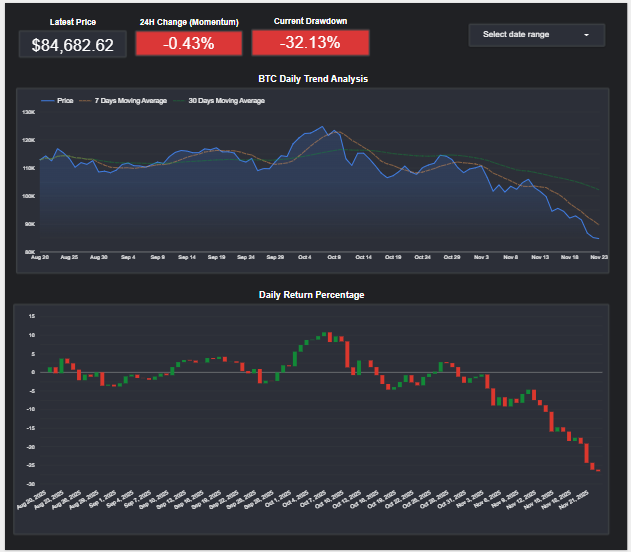

# Automated Bitcoin Analytics Pipeline (Airflow + BigQuery + dbt + Looker Studio)

This project implements a fully automated ELT pipeline for daily Bitcoin analytics.  
It extracts Bitcoin price data from the CoinGecko API, loads it into BigQuery, transforms it using dbt, and powers an auto-refreshing Looker Studio dashboard.  
All tasks are orchestrated with Apache Airflow running in Docker.

## Architecture

<p align="center">
    
</p>

## Features

### 1. Automated Extraction (Airflow + Python)
- Daily Airflow-triggered API ingestion.
- Python script calls CoinGecko API for latest Bitcoin prices.
- Raw JSON normalized into structured rows.

### 2. Cloud Loading (BigQuery)
- Data loaded into a raw staging dataset.
- Secure authentication via service account.
- Automatic schema handling.

### 3. Transformations (dbt Core)
- Staging models rename and standardize fields.
- Core models generate:
  - Daily price history  
  - Calculated metrics (7-day MA, 30-day MA, % change, volatility)
- Data tests ensure quality and consistency.

### 4. Visualization (Looker Studio)
- BigQuery models feed directly into Looker Studio.
- Dashboard updates automatically whenever new data arrives.

---

## Pipeline Flow

```
CoinGecko API
↓
Python Extract Script (Airflow Task)
↓
BigQuery (raw dataset)
↓
dbt Models (staging → core → marts)
↓
BigQuery (analytics dataset)
↓
Looker Studio Dashboard
```

## Project Structure

```
project/
│
├── airflow/
│   ├── .dbt/                              # dbt profiles configuration
│   │   └── profiles.yml
│   ├── dags/
│   │   └── bitcoin_daily_pipeline.py      # Airflow DAG definition
│   ├── keys/                              # GCP service account credentials
│   │   └── bq_service_account.json
│   ├── Dockerfile                         # Custom Airflow image
│   └── docker-compose.yaml                # Container orchestration
│
├── dbt/
│   ├── dbt_project.yml
│   └── models/
│       ├── staging/
│       │   └── stg_coingecko_bitcoin.sql  # Staging model
│       └── marts/
│           └── fct_bitcoin_analytics.sql  # Analytics fact table
│
├── notebooks/
│   ├── 01_Dev_Bitcoin_API_Explore.ipynb   # API exploration
│   └── daily_price_Bitcoin_API_Explore.ipynb
│
├── scripts/
│   ├── backfill_history.py                # Initial historical load (91 days) - Backfill
│   └── append_daily_bitcoin_data.py       # Daily incremental load
│
└── README.md
```

## Tech Stack

| Component | Tool(s) Used | Role in Pipeline |
| --- | --- | --- |
| **Orchestration** | **Apache Airflow** (Dockerized) | The "Robot Foreman" that runs the entire pipeline on a schedule (`0 5 * * *`). |
| **Extract (E)** | **Python** (`requests`, `pandas`) | Securely fetches data from the CoinGecko API. |
| **Load (L)** | `pandas-gbq` | Appends the clean, daily data point to BigQuery. |
| **Warehouse** | **Google BigQuery** | The cloud data warehouse for storing raw and modeled data. |
| **Transform (T)** | **dbt Core** | Cleans, models, tests the data, and pre-calculates all metrics. |
| **Visualization** | **Looker Studio** | Displays the final, tested data for business consumption. |
|**Containerization**| **Docker**, **Docker Compose**|

## Pipeline Overview

### DAG: `bitcoin_daily_pipeline`

**Schedule:** Daily at 05:00 UTC

**Tasks:**

1. **extract_and_load** - Runs Python script to fetch daily Bitcoin price from CoinGecko and append to BigQuery
2. **dbt_run_models** - Executes dbt transformations
3. **dbt_test_models** - Runs dbt tests for data quality

```
extract_and_load >> dbt_run_models >> dbt_test_models
```

## Scripts

### Initial Load (`backfill_history.py`)

Fetches 91 days of historical Bitcoin price data and loads it into BigQuery. Run this once to bootstrap the dataset:

```bash
python scripts/backfill_history.py
```

### Daily Incremental Load (`append_daily_bitcoin_data.py`)

Fetches the current day's Bitcoin price and appends it to the existing BigQuery table. This script is executed daily by the Airflow DAG.

## dbt Models

### Staging Layer

`stg_coingecko_bitcoin.sql` - Cleans and standardizes raw data from the source table.

### Marts Layer

`fct_bitcoin_analytics.sql` - Calculates analytics metrics including:
- 7-day and 30-day moving averages
- Daily return percentages
- Drawdown from all-time high
- Price momentum indicators

## Dashboard
<p align="center">
  <a href="https://lookerstudio.google.com/s/kRSVpRnc4ro" target="_blank">
    
  </a>
</p>

[Live Dashboard on Looker Studio](https://lookerstudio.google.com/s/kRSVpRnc4ro)

The analytics output powers a dashboard displaying:

- **Latest Price** - Current Bitcoin price in USD
- **24H Change (Momentum)** - Daily price movement percentage
- **Current Drawdown** - Percentage below all-time high
- **BTC Daily Trend Analysis** - Price chart with 7-day and 30-day moving averages
- **Daily Return Percentage** - Bar chart showing daily gains/losses


## Prerequisites

- Docker Desktop installed and running
- Google Cloud Platform account with BigQuery enabled
- GCP service account with BigQuery permissions
- CoinGecko API key (free tier works)

## Setup

### 1. Clone the Repository

```bash
git clone <https://github.com/raymanwaytt/bitcoin_daily_price>
cd project
```

### 2. Configure Environment Variables

Create a `.env` file in the `airflow/` directory:

```env
AIRFLOW_UID=50000
GECKO_API_KEY=your_coingecko_api_key
GCP_PROJECT_ID=your_gcp_project_id
```
`NOTE: Airflow Variables override environment variables. Ensure your .env secrets match what you configure in Airflow.`

### 3. Add GCP Service Account Key

Place your BigQuery service account JSON key in:

```
airflow/keys/bq_service_account.json
```

### 4. Configure dbt Profile

Create `airflow/.dbt/profiles.yml`:

```yaml
coingecko_bitcoin:
  target: dev
  outputs:
    dev:
      type: bigquery
      method: service-account
      project: your-gcp-project-id
      dataset: btc
      location: US
      keyfile: /opt/airflow/keys/bq_service_account.json
      threads: 4
```

### 5. Build and Start Services

```bash
docker-compose build
docker-compose up -d
```

### 6. Access Airflow UI

Open http://localhost:8082 in your browser.

Default credentials:
- Username: `airflow`
- Password: `airflow`

### 7. Configure Airflow Variables

In the Airflow UI, navigate to Admin → Variables and add:

| Key | Value |
|-----|-------|
| `GECKO_API_KEY` | Your CoinGecko API key |
| `GCP_PROJECT_ID` | Your GCP project ID |


## Useful Commands

### Docker Operations

```bash
# Start all services
docker-compose up -d

# Stop all services
docker-compose down

# Rebuild after Dockerfile changes
docker-compose up -d --build

# View logs
docker-compose logs -f airflow-scheduler
```

### dbt Operations (inside container)

```bash
# Enter the scheduler container
docker exec -it airflow-airflow-scheduler-1 bash

# Test dbt connection
dbt debug --project-dir /opt/airflow/projects/dbt

# Run models
dbt run --project-dir /opt/airflow/projects/dbt

# Run tests
dbt test --project-dir /opt/airflow/projects/dbt
```

### Airflow CLI

```bash
# List DAGs
docker exec -it airflow-airflow-scheduler-1 airflow dags list

# Trigger DAG manually
docker exec -it airflow-airflow-scheduler-1 airflow dags trigger bitcoin_daily_pipeline
```

## Troubleshooting

### dbt profile not found

Ensure your volume mount uses `.dbt` (with dot):
```yaml
- ./.dbt:/home/airflow/.dbt
```

### Permission denied errors

Set the correct `AIRFLOW_UID` in your `.env` file:
```bash
echo "AIRFLOW_UID=$(id -u)" >> .env
```

### BigQuery authentication failed

Verify your service account key path and permissions:
```bash
docker exec -it airflow-airflow-scheduler-1 ls -la /opt/airflow/keys/
```

## License

This project is licensed under the Apache License 3.0.